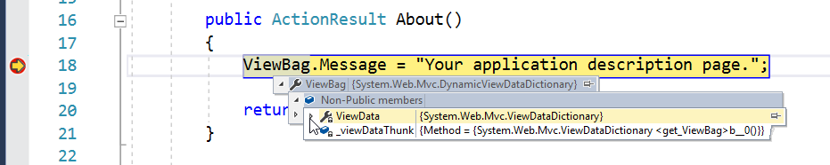
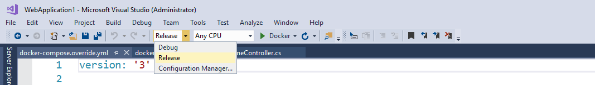

# Introduction to Windows Containers in Docker EE

This demonstration highlights developing and running applications with Windows Containers and Docker Enterprise Edition.

## Pre-Requisites
    
* Docker EE cluster with minimum of one [Windows Server 2016 worker node](https://docs.docker.com/datacenter/ucp/2.2/guides/admin/configure/join-windows-worker-nodes/)

* Windows developer environment. This can be the same VM running the worker node, a separate VM, or a laptop running Windows 10 Fall Creators Update.

* [Visual Studio 2017 Community Edition](https://www.visualstudio.com/thank-you-downloading-visual-studio/?sku=Community&rel=15) (Free)

## Setup

### Windows developer environment setup

1.  Create a sample application in Visual Studio. 

    Select **File** -> **New** -> **Project**.

    

    In the left pane, select **Visual C#**, then **Web**, then **ASP.NET Web Application** and select **OK**

    

    Select **MVC**, and ensure that Authentication is set to **No Authentication** then click **OK**

    

    Click the green play icon from the toolbar. This will download all dependencies for the application, build the solution, and run the application on the local VM with a debugger attached.

    

    > Pre-downloading and compiling the application saves time during the demo (especially on slow wi-fi networks)

    Confirm the application displays properly in a browser window

    

1. Windows Server 2016 ships with an older version of Internet Explorer, which does not always properly display UCP & DTR. [Download](https://www.google.com/chrome/browser) a newer browser for the demonstration. 

1. Increase the default font size in a running PowerShell window by right-clicking the top toolbar, selecting **Properties**, clicking the **Font** tab, and selecting ~**16**.

### Windows worker node setup

1. Run Windows Update to install every single patch available. Many container features require the latest patches being installed. Skipping this will cause pain.

1. Windows container images are often multiple gigabytes in size. Pre-pull a variety of common [Microsoft images](https://hub.docker.com/u/microsoft/) to the node(s) prior to any demos to ensure there is not a delay mid-demo.

    ```sh
    docker pull microsoft/windowsservercore:latest
    docker pull microsoft/nanoserver:latest
    docker pull microsoft/iis:latest
    docker pull microsoft/aspnet:latest
    ```

    > Avoid images tagged with any variation "1709", as these rely on Windows Server 1709 and [are not compatible](https://docs.docker.com/engine/installation/windows/ee-preview/#faq)

### UCP setup

1. [Configure LDAP integration](https://docs.docker.com/datacenter/ucp/2.2/guides/admin/configure/external-auth/)

1. Create 3-5 Organizations. If known, tailor this to the customer's department. Else, Microsoft uses a set of [sample companies](https://en.wikipedia.org/wiki/List_of_fictional_Microsoft_companies) in their demos that are typically recognized by customers: `contoso`, `adventureworks`, `fabrikam`, `northwind`, and `coho` are a few.

1. Create teams for `engineering` and `operations` under the contoso organization

1. Deploy a stack named `viz` for the Docker Swarm Visualizer

    ```yml
    version: "3.3"

    services:
    web:
        image: dockersamples/visualizer
        volumes:
        - "/var/run/docker.sock:/var/run/docker.sock"
        ports:
        - 8080
        deploy:
        placement:
            constraints:
            - node.role == manager
    ```

### DTR Setup

1. Create a repository under the `contoso` organization named `webapp` configured for [scan on push](https://docs.docker.com/datacenter/dtr/2.4/guides/user/manage-images/scan-images-for-vulnerabilities/#security-scan-on-push) and [immutability](https://docs.docker.com/datacenter/dtr/2.4/guides/user/manage-images/prevent-tags-from-being-overwritten/)

## Demonstration Script

1. Running Windows containers

1. Integrating Docker into an existing ASP.NET application and building an image

1. Pushing an image into DTR

1. Deploying an image to a cluster with UCP

1. Scaling an application

### Hello World with IIS

> Many Microsoft shops are *very* new to containers and have found this section helpful. Feel free to skip this section if the audience is already familiar with container basics. 

One of the key benefits of deploying workloads in containers is the sheer speed of deployment. To visualize this speed, I'm going to open the PowerShell ISE and fire up a few containers. This simple loop does two tasks:

* First, it uses the Docker command line interface to create a container running the IIS web server. Since containers by default are fully isolated, we are explicitly opening port 80 to allow access.

* Second, it displays the IP address for the web server when creation completes

```powershell
For ($i=1; $i -le 5; $i++) {

    # Create a container running IIS
    docker run --detach --publish 80 microsoft/iis:nanoserver | 
    
    # Echo out IP address
    ForEach-Object { docker inspect --format '{{ .NetworkSettings.Networks.nat.IPAddress }}' $_ }

}
```


In mere seconds, we have created 5 full instances of the IIS web server. Copying and pasting one of the IP addresses into a browser, we can see the familiar blue IIS start screen. This server is not running locally in my VM, but within an isolated Windows container. I do not even have the IIS feature installed on this developer VM. 


While a simple example, this same process with virtual machines would have invovled substantially longer boot times and system resources. The increased agility and lighter footprint of containers enables faster deployments  

Similar to the creation, removing these containers is equally fast with a line of PowerShell. Note that my host VM is entirely untouched, without files strewn across the disk or a variety of configuration options that I have to reset. The web server was entirely isolated without any impact to the host. 

```powershell
docker rm --force $(docker ps -a -q)    
```

### 2. Integrating Docker into an existing ASP.NET application and building an image

Developing containerized applications does not drastictly change a developer's workflow. Opening Visual Studio, we have an existing ASP.NET MVC application. Clicking debug, we can see it running in a browser on my local VM. 

Transitioning this application to a container involves creating a Dockerfile. While we could manually create the file and add it to the web project, Visual Studio includes a set of features that make developing containers easier. Starting with Visual Studio 2015, Microsoft has provided the [Visual Studio Tools for Docker](https://docs.microsoft.com/en-us/dotnet/standard/containerized-lifecycle-architecture/design-develop-containerized-apps/visual-studio-tools-for-docker). Originally a separate plugin, Visual Studio 2017 includes the tools baked directly into the IDE, a sign of how important Microsoft views container development. Best of all, this feature is included in Visual Studio Community edition and does not require paid versions of Visual Studio. 

Right clicking on the web project an hovering on **Add**, we can simply click **Docker Support**.


Adding Docker support to our VS Solution scaffolds out several features. First is the Dockerfile. Visual Studio does its best to infer what type of application we are developing, and selects an appropriate base image for the `FROM` line. For this application, `FROM microsoft/aspnet:4.7` was selected, meaning that when we build our application Docker will download the aspnet base image from the Docker Hub on our behalf. Microsoft creates and maintains a vast array of images on Docker Hub, including [Windows Server Core](https://hub.docker.com/r/microsoft/windowsservercore/), [Nanoserver](https://hub.docker.com/r/microsoft/nanoserver/), [IIS](https://hub.docker.com/r/microsoft/iis/), [aspnet](https://hub.docker.com/r/microsoft/aspnet/), [aspnetcore](https://hub.docker.com/r/microsoft/aspnetcore/),  [WCF](https://hub.docker.com/r/microsoft/wcf/), and [SQL](https://hub.docker.com/r/microsoft/mssql-server-windows-express/). The Dockerfiles that they use to build these images are also provided on [GitHub](https://github.com/Microsoft/aspnet-docker) so that users can reverse-engineer and customize images to their specific needs. 

Images on Docker Hub, while created and maintained directly by Microsoft, are only a starting point. Most organizations take the aspnet image from Docker Hub, customize it to match their specific corporate standards, and push   it to their private registry as a "golden image". A developer would then start with that golden image on the `FROM` line, rather than the vanilla aspnet from Microsoft.

The remainder of the Dockerfile copies compiled application code to `C:\inetpub\wwwroot`, the default folder location for IIS. This file is a starting point, as most applications will require additional configuration. Common configurations include setup of environment variables, unattended installation of third party MSI or EXE files, and tweaks to the Windows Registry. The vast majority of an application's runbook or setup documentation can be encapsulated into this file, significantly simplifying the creation of deployment artifacts.


If the Visual Studio Solution consisted of separate projects for a ASP.NET MVC front end, a ASP.NET WebAPI services tier, and a SQL database, then a Dockerfile would be placed in each project. These individual projects are managed together in the docker-compose.yml file. The Compose file is used by Docker to manage the deployment of the entire solution, and can involve multiple tiers or microservices in a single file. Normally a developer will set the `image` property to match the name of the project's repository in a private registry. I'll update the setting to `<YOUR_REGISTRY>/contoso/webapp`.


In addition to scaffolding out Docker related files, Visual Studio supports debugging within containers. Notice on the toolbar that the green "Start with Debugging" arrow now has the word **Docker** next to it. I'll open **Controllers** -> **HomeController.cs** and add a breakpoint in the `About()` method, then click the green debugging arrow. Over the next 30 seconds, the Docker Engine takes that docker-compose.yml file, builds Docker images for each of the projects, and creates an instance of each image as a container. Then Visual Studio attaches its debugger to the application that is running within the container and opens our browser.


Notice that the URL is not "localhost", but is instead an IP address pointing to the successfully containerized application. If we click on the **About** tab on the top navigation bar, the set breakpoint is hit in the container and not the local developer environment. This is a powerful capability for developers working on containerized applications.

> Debugging works *most* of the time, but is known to be brittle and buggy. If not working during a dry run-through, delete all pre-built images and Visual Studio solutions and retry



The last feature of Visual Studio to call out involves greenfield applications rather than existing code bases. When developing new .NET Core applications, there is a box in the template creation wizard to indicate if you'd like to scaffold the project with Docker Support included. This deep inclusion of Docker capabilites into Microsoft's flag ship IDE represents one of numerous investments that is being made to ensure a first-class developer experience for programmers creating containerized applications.

### 3. Pushing an image into DTR

Sharing of Docker images happens in the Docker Trusted Registry, or "DTR". The DTR is a central storage point for all Docker images across an organization, covering both Linux and Windows applications. A developer or continuous integration server will "push" a built Docker image from their environment to the DTR, where others in the organization can "pull" it to download and run the application. Visual Studio already built our application into a container with the tag `:dev`, which we can see in PowerShell.

```powershell
docker images
```

Logging into our private DTR requires a username and password, which conveniently has been synced from Active Directory. After the login command we can push the image to DTR.

```powershell
docker login dtr.ishmael.in

docker push dtr.ishmael.in/contoso/webapp:dev
```




### 4. Deploying an image to a cluster with UCP

### 5. Scaling an application

## Clean Up